- [1. 简介](#1-简介)
- [2. 学员篇](#2-学员篇)
  - [2.1. 登录](#21-登录)
    - [2.1.1. Web登录](#211-web登录)
    - [2.1.2. 钉钉企业内H5微应用登录](#212-钉钉企业内h5微应用登录)
    - [2.1.3. 移动APP登录](#213-移动app登录)
- [3. 功能介绍](#3-功能介绍)
  - [3.1. 导航](#31-导航)
  - [3.2. 全局搜索](#32-全局搜索)
  - [3.3. 公共课程](#33-公共课程)
  - [3.4. 话题小组](#34-话题小组)
  - [3.5. 讲师导师](#35-讲师导师)
  - [3.6. 公共专题](#36-公共专题)
  - [3.7. 学习中心](#37-学习中心)
  - [3.8. 个人中心](#38-个人中心)

# 1. 简介
恒实网校旨在恒实科技内部人才培养为目标的学习平台。为恒实科技提供知识体系建设，内部讲师队伍组建，线上培训项目实施，员工成长管理，企业学习文化建设等提供平台产品支撑，助力公司长久发展。

网校地址：http://school.techstar.com.cn:8081/

# 2. 学员篇
## 2.1. 登录
网校不支持用户手动注册，所有的账号由管理员统一创建和管理，支持钉钉账号认证登录。

### 2.1.1. Web登录
登录页面如下图所示。

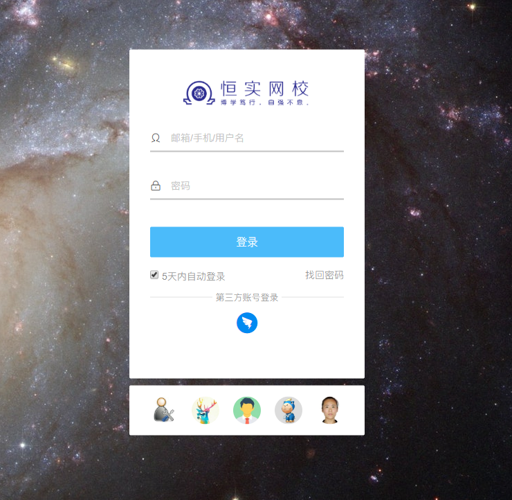

用户名和密码由管理员统一发放；下方一排显示得是最近登录学员的头像。支持第三方钉钉登录，点击弹出二维码。

通过钉钉移动端 APP 扫码登录。

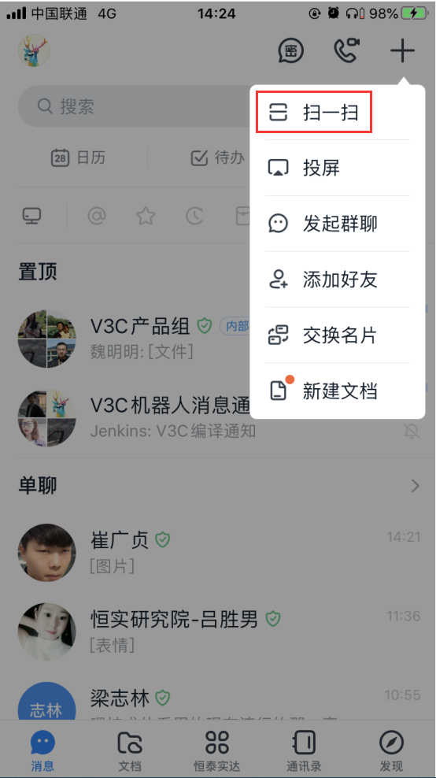

第一次登录需要启用新账号。

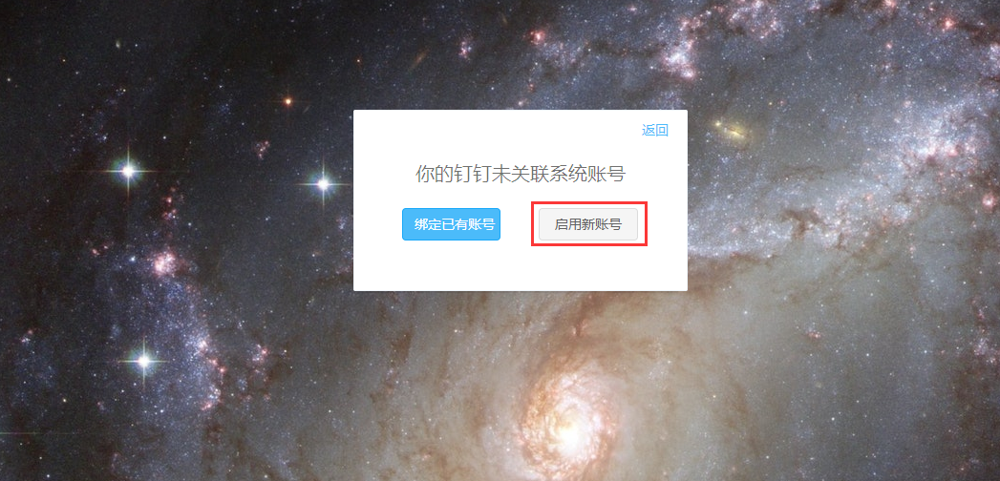

出于安全考虑，首次登录的用户，需要修改密码。

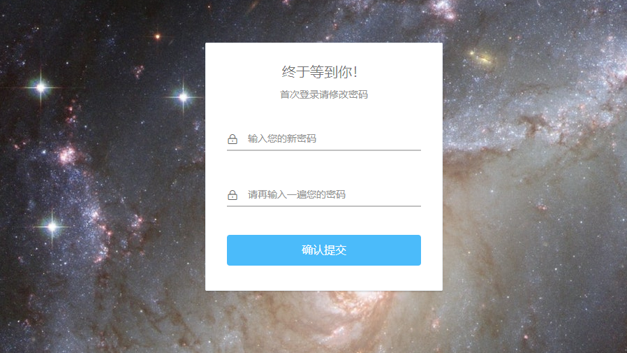

>注意：
>此新密码是独立密码不会修改钉钉密码。

### 2.1.2. 钉钉企业内H5微应用登录

打开钉钉，点开公司企业应用主页。

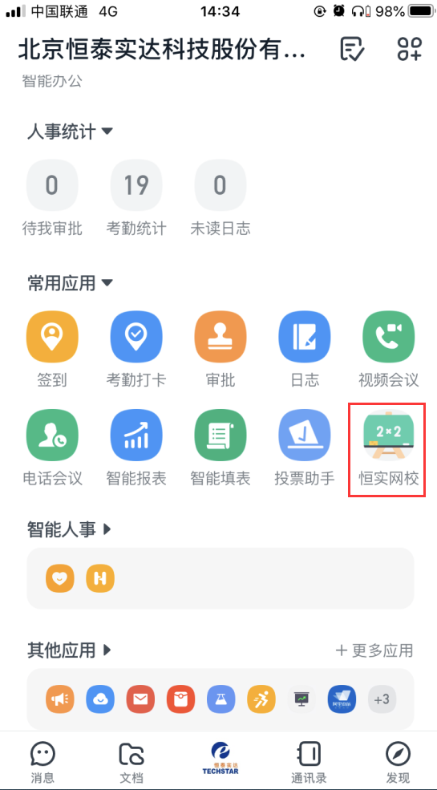
>注意：
>H5微应用登录可直接认证，毋须扫码动作。

登录成功后，我们可以看到网校的课程。

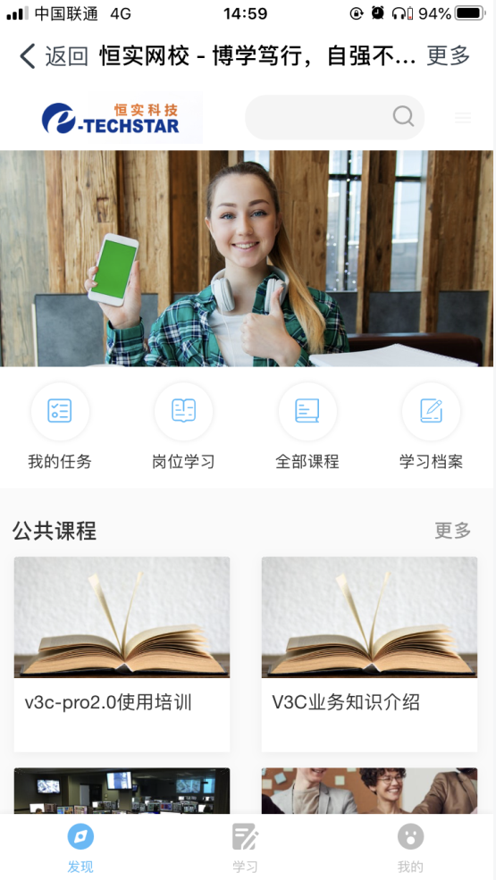

### 2.1.3. 移动APP登录

打开浏览器访问：http://school.techstar.com.cn:8081/mobile/

使用手机扫码下载APP。

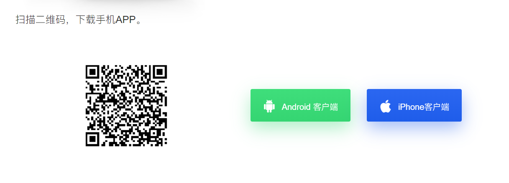

首次使用 移动APP 登录之前，先登录 WEB 端获取登录二维码。

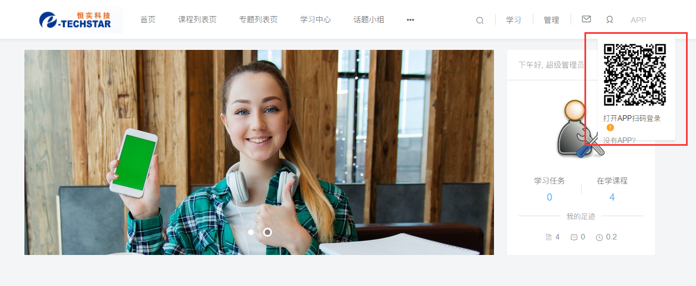

然后使用移动APP扫码登录。

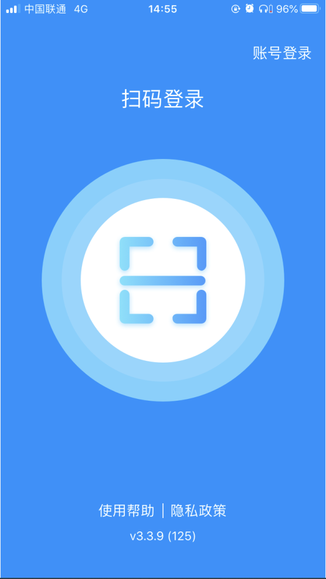

登录成功后，我们可以看到网校的课程。

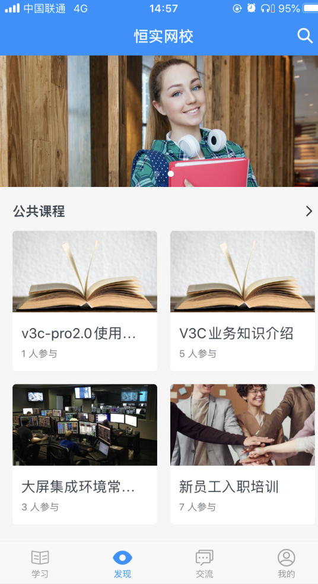

# 3. 功能介绍
## 3.1. 导航
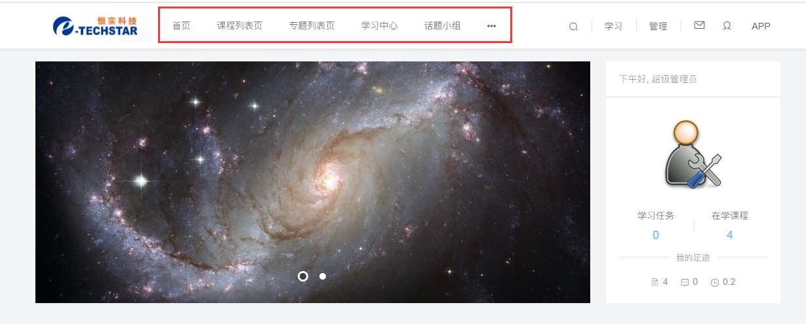

## 3.2. 全局搜索
全站课程搜索栏，如下图蓝色框所示，可以搜索课程、培训项目、专题、活动、资讯和小
组话题，其中，搜索课程时，可以搜到课程中的任务名。

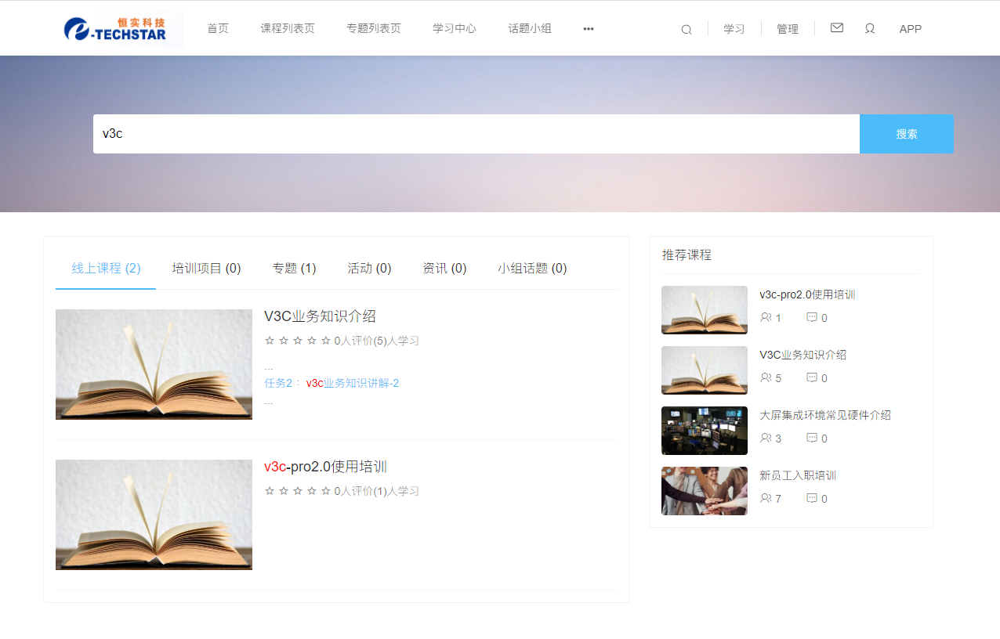

## 3.3. 公共课程
展示了公司的公共线上课程(课程发布范围设置为面向全公司全部门的课程，后面的子
栏目为课程的分类。被推荐的课程会排在前面。

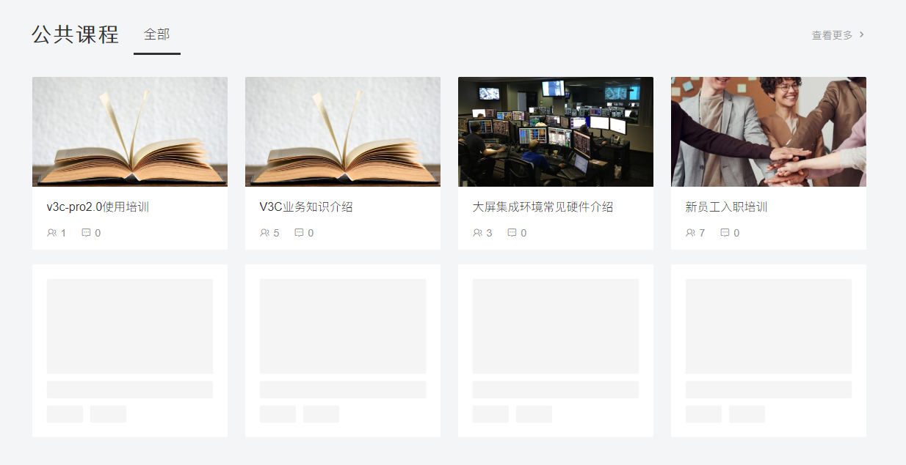

点击查看更多可跳转到课程列表页，支持按分类、标签、进行筛选。

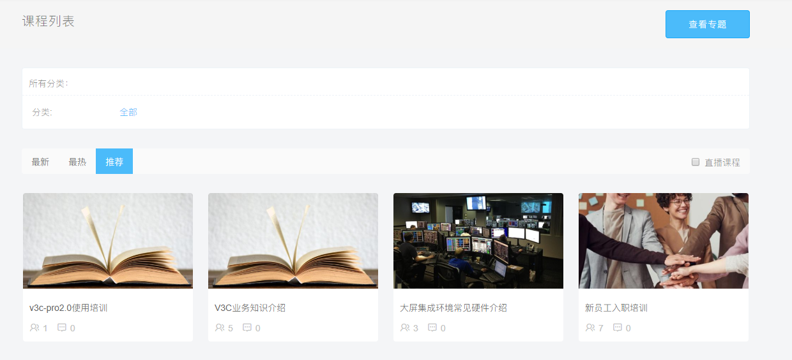

## 3.4. 话题小组
这里展示了话题小组模块，类似于贴吧功能。

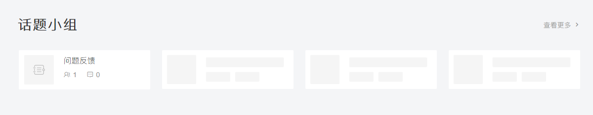

点击查看更多可跳转到话题小组列表页，可在此加入或创建新的话题小组。

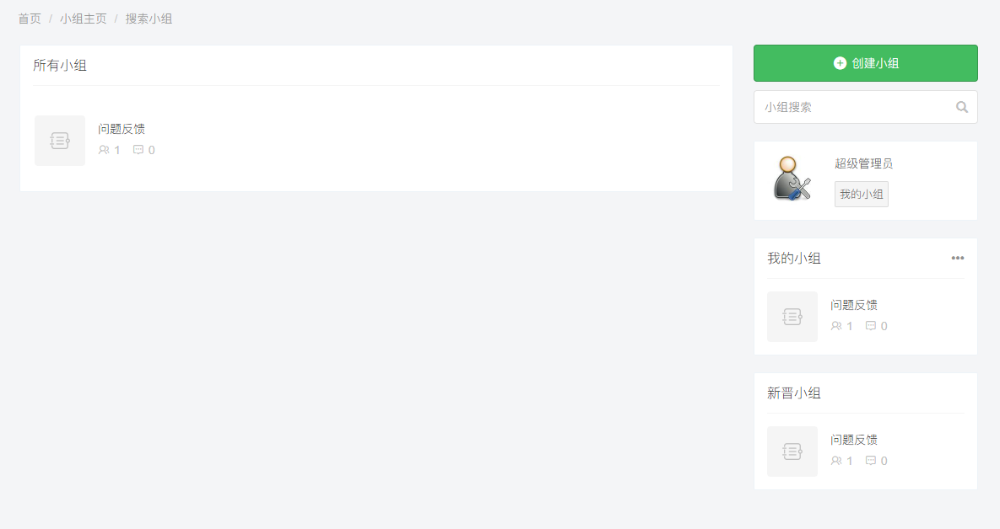

## 3.5. 讲师导师
展示了公司的讲师风采，被推荐的讲师可以排名更靠前。

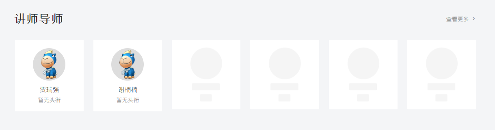

点击查看更多可以跳转到所有讲师列表页，支持按讲师等级、专业领域和部门进行筛
选，也支持按用户名精确搜索。

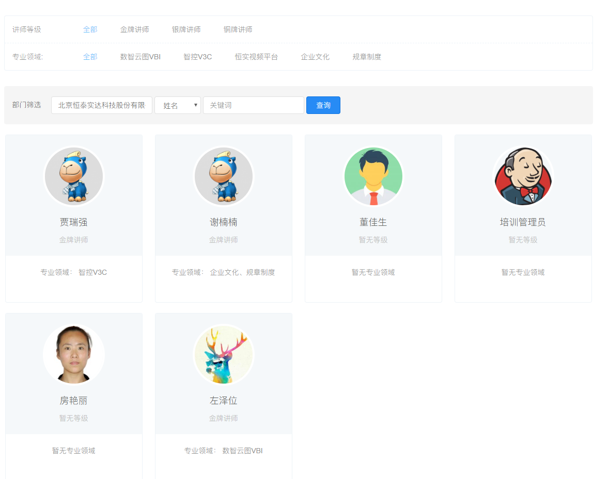

## 3.6. 公共专题
展示发布范围设置为面向全公司全部门的课程专题。

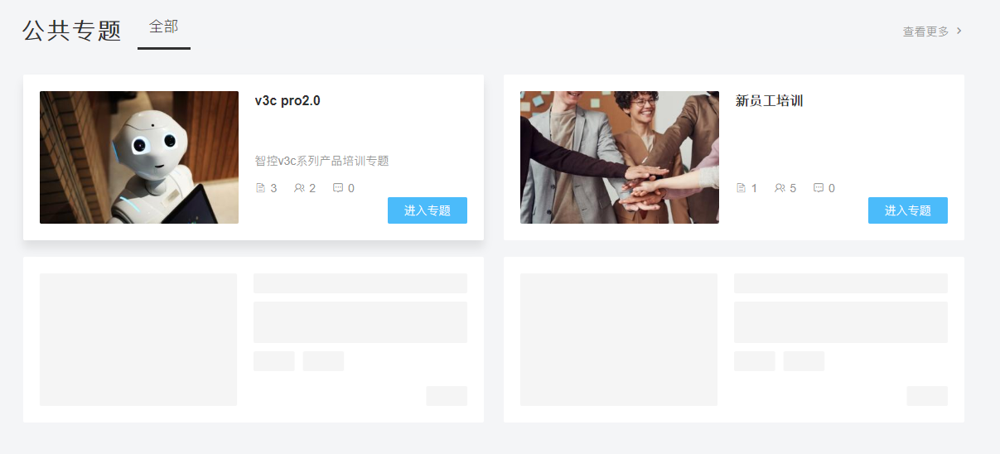

## 3.7. 学习中心
用户可以点击导航栏上的“学习中心”或“学习”按钮进入用户的学习中心。

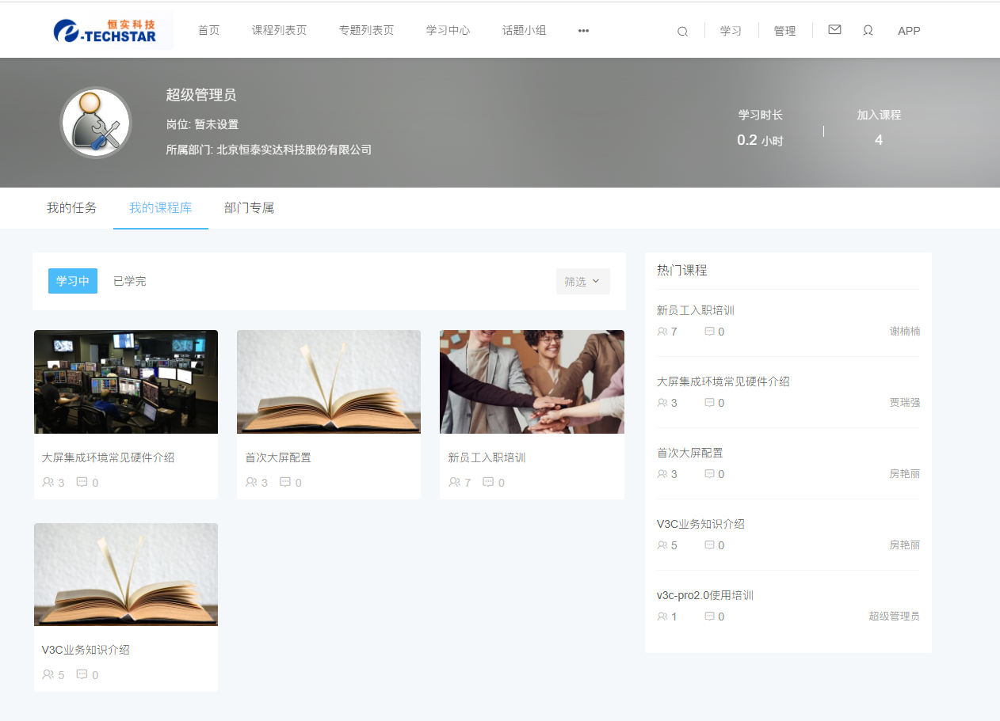

>图中顶部导航下的区域就是学习中心概览，展示用户的基本信息和学习情况。

## 3.8. 个人中心
这里展示的是学员的基本信息和学习情况。如果该员工是老师，会比普通员工多出“在
教课程”和“在教专题”两个板块。
如果用户对该员工感兴趣，可以关注 TA，成为他的粉丝，实时掌握 TA 的动态。

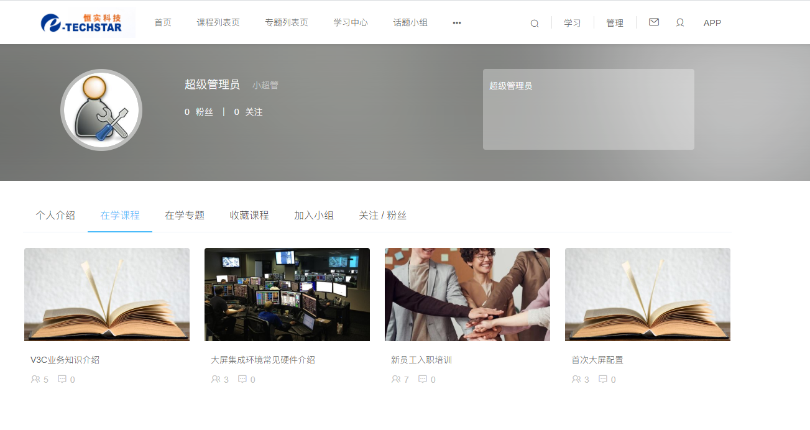